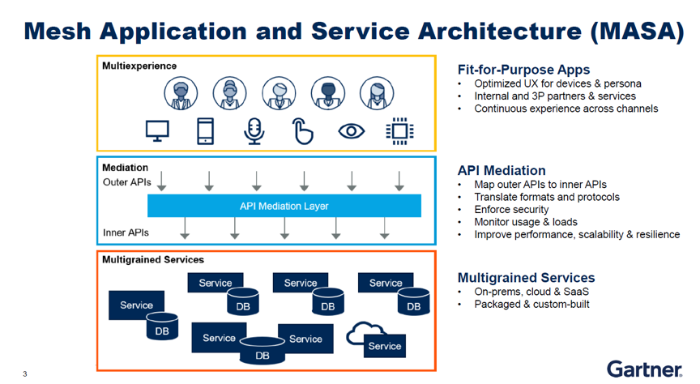

# 中台的概念

什么是中台? “中台”是一个源自中国的概念，具体点说是源自阿里巴巴的电商系统架构经验，国外的技术语言体系里根本没有中台。

## Gartner给了中台一个英文翻译，但更有自己的方法论

当中国记者问AWS的云布道师Ian MassingHam关于中台问题时，现场的翻译专家纵然是英语十八级也茫然四顾不知怎么翻译“中台”，经过一番解释后Ian若有所悟，随即表示AWS更关注按照用户需求来做方案。

2019年11月15日，笔者在Gartner的PPT里看到了中台的英文翻译，叫做“Middle Platform”，我想，如果下次再跟外国人介绍中台的时候，不妨统一把中台翻译成“Middle Platform”，介绍具体含义的时候，可以参考Gartner对中台的理解，即“Packaged Business Capability”封装的业务能力。毕竟，这是为数不多的诞生自中国的技术和理念。

“中台”是一个源自中国的概念，具体点说是源自阿里巴巴的电商系统架构经验，但以AWS为代表的国际云巨头对此却一无所知，可见国外的技术语言体系里根本没有中台，而Gartner在介绍中台的过程中，也着重强调是阿里巴巴自己提出的概念。

近日，Gartner高级研究总监沈哲怡（Sandy Shen）介绍了Gartner的MASA（Mesh Application and Service Architecture：网格应用和服务架构）企业应用架构方法论。作为企业应用架构的指导思想，乍看之下，MASA与中台有几分类似，都是上中下三层，但事实上，两者有很大不同。

阿里的中台是源自在电商建设中的经验。中台一方面要对接企业内部的ERP、CRM之类的系统，一方面还提供各种外部系统的管理服务，包括产品管理、库存管理、支付系统、订单系统、客服系统和物流系统，最后服务于前端。

与中台不同，Gartner MASA架构的提出是在与国内外许多从事企业信息化工作的供应商以及企业用户的长期沟通中总结而成。

MASA架构认为企业只有前端和后端，企业的营销管理系统（Marketing）、商务系统（Commerce）、销售管理系统（Sales）、数字资产管理系统（DAM）等等都属于企业的后端，除此之外，所有直面客户的端都是前端。

看起来挺像的，为什么Gartner说两者不一样呢？

中台是一层包含一定业务能力的应用平台。而MASA则涵盖了前端的用户体验、后端的业务能力，以及系统连接的方式。

在Gartner看来，前端要具备Multiexperience（多样化用户体验）。在触达客户的时候，能为在不同的场景里的不同的角色提供不一样的使用体验；即使是同一个用户在不同的终端上，也需要不一样的设计。总之，就是能以各种形式将资源拼接起来提供服务。

而在后端，Gartner强调要用不同的粒度来组织后端服务。所谓不同粒度是指，企业存在的大型单体应用（比如ERP/CRM）的功能块之间紧密相连，对外输出能力的接口有限，往往属于大颗粒度应用（Macroservices）。微服务（Microservices）则是在很多细分功能有相对独立模块并且每个模块都有对外接口。介于两者之间的则叫小服务（Miniservices）。

中台更强调微服务的能力，只有微服务一种服务精细度，而Gartner的MASA架构认为企业内应共存各种不同精细度的应用。Gartner认为，企业既需要精细度高、敏捷灵活度高的应用，也需要大型应用。企业需要在两者之间找到平衡，而不是所有应用都要分解到微服务。中台并没有涉及前端用户体验和系统连接方式的能力。

Gartner MASA中的API解析层给整个架构带来了灵活性。一方面解析层让前端和后端解耦，连接了前后端，让不同的API、传输协议、数据格式等相互转换，使得前后端相对独立有、能灵活调用所需的服务。另一方面，它也是企业对实施应用治理的一种重要手段。对平台的安全性、用户身份认证、流量监控、负载平衡、盈利模式等都可以通过API解析层来管理。

虽然中台是一种比较具体的解决方案，MASA是企业架构的方法论，但他们所追求的目的一致：让企业通过应用架构的改造获得更大的灵活性和敏捷性。

Gartner的MASA架构要发挥作用必须依靠API解析层，但仅仅有解析层还不够，仍需要一个综合的API管理平台来管理针对不同类型的API用户，比如内部和外部开发人员以及合作伙伴，为不同人群提供API服务。该平台还需要引入产品管理的理念，根据业务需求制定API的开发路线图。企业还需要为API建立商城，让各种API用户都能方便地找到所需的API。

Gartner不认可中台厂商把所有已有数据复制一份、统一管理的做法，认为这会引出数据管理和数据治理方面的问题。Gartner更建议企业掌握更为宏观的数据管理战略，根据需求去决定哪些数据需要同步、哪些数据需要放到集中的数据库里。

中台侧重具体的方法技术和方案，而Gartner的MASA架构是方法论。一定程度上，中台的落地可以帮助企业的传统应用开放接口，有利于朝着MASA的目标架构演进，两者并不矛盾，而且在一定程度上互有重合，前期采用了中台的方案也不影响后期朝着MASA的方向发展。

沈哲怡表示，MASA是Gartner给企业的方法论，是一个持续的、长期的方向，可以针对现有架构逐渐进行调整。例如，缺少前端用户体验设计的架构可以在MASA的指导下不断朝着多用户体验的方向迭代发展。此外，缺少多种粒度的服务设计也可以朝着这个方向发展。

沈哲怡还指出，MASA只是一个终极目标，能否实现目标的关键在于企业能根据自身业务需求来规划好面向未来发展的架构体系，同时引入产品管理的理念来管理好各种产品，而不轻易被第三方厂商所左右。

MASA是Gartner的《2017年十大战略科技发展趋势》中的一个趋势，它总结了企业在数字化转型过程中出现的问题，MASA所说的mesh是一个多维模型程序。在这个模型下，一群应用程序和服务之间既相互连接，也经常调用其他的应用程序能力来创建自身功能。通过API向外部开放该功能，MASA的愿景是让企业中的员工、业务流程、服务、内容和设备之间实现丰富、流畅和动态的连接。

沈哲怡最后表示，MASA在国外的企业中接受度颇高；而在中国，数字化成熟度较低，MASA对于很多企业而言还是比较新的理念，需要一段时间去理解消化而后付诸实施。但总体而言，MASA的方法论适用国内外任何企业，但数字化成熟度低的企业执行相对吃力，通常需要借助外部力量，比如咨询公司或外包开发商。

文章引用 [[Gartner给了中台一个英文翻译，但更有自己的方法论](https://www.doit.com.cn/p/348653.html)]
