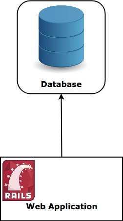
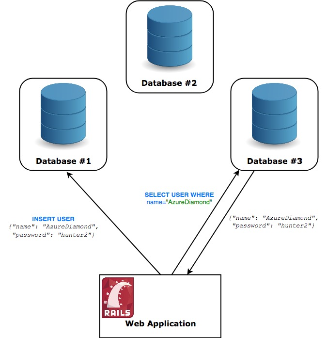
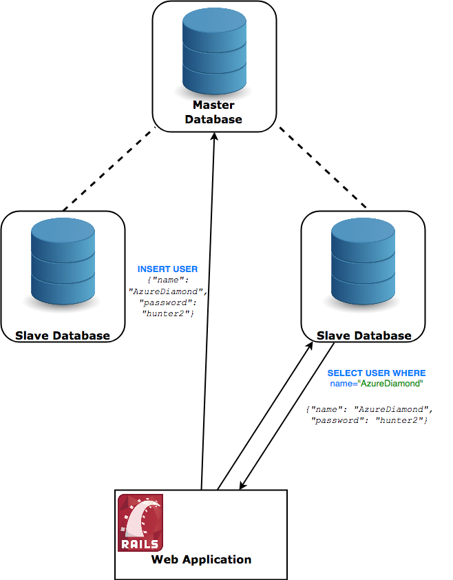

# 什么是分布式系统

随着现今技术每年更新迭代，接入的设备的越来越多，服务结构所承受的压力也越来越大，为了顺应这些变化，分布式系统应运而生并且向无处不在的设备提供着实时、高效的服务。

但是分布式系统又是一门非常复杂的科学，它的研究可以说从90年代互联网浪潮与Web应用铺天盖地的出生开始，到如今大数据、云计算、AI、边缘计算都离不开它的思想。它是以网络为核心，操作系统为基石，并在其之上进行通信、交互信息的应领域方向。我们这里不会以高健全的视角向大家展示分布式应用，而是以非常简单的方式、语言给大家说明什么是分布式系统，以及它的核心定义，解决的问题，面临的问题。

分布式系统将有限个数的计算机资源统一成一个整体，从外部用户看来就好像只有一个计算机在提供服务一样。这些计算机共享着彼此的状态，处理并发的请求，但是并不因为其中一台发生灾难宕机而影响全局系统的正常运行。

分布式系统并不局限于完整业务链的商业应用，它可以是web集群+Server集群+数据库集群互相配合提供服务的复杂业务系统，也可以是独立的数据库集群、web应用集群等等。

我们先用一个简单的web服务+单点数据库的模型给大家展示传统的单体应用结构：

一般而言，传统的数据库都是发布一台物理机上，所有业务的增删改查都在这台机器上完成。这没有什么问题，单体应用适应小的业务系统，这种系统一般并发不高、没有横向扩展要求。系统越简单出事的可能越小。但是系统是基于商业业务而创造，没有一成不变的业务，自然没有不变的系统，成长的业务推动系统的扩展，也会让系统不堪压力。

假设现在随着我们业务的发展，每秒的请求越来越多，现有的单点数据库承受不了这个压力，我们要把数据库扩展以达到服务要求。摆在我们面前的有两个方案：

- 增加数据库服务器配置
- 增加数据库节点

再假设我们向上图那样扩展了我们的数据库系统，用户的请求可以选择任意一台数据库进行查询，但是，请求不能够被告之它调的不是一台单一的数据库，换句话说，请求自身并不知道数据库是有多台的。如果请求向数据库节点#1插入了一条数据，那么节点#3与#2都必须能返回刚插入的记录。

现在我们可以认为我们的数据库是分布式的了。

## 为什么要分布式系统

上面的小节里我们提到系统在发展过程中不可避免随着商业发展进行扩展，迭代，系统向分布式化的发展是必然的。不过摆在我们面前的现实是，我们并不能简单把弱的环节扩展万事大吉了，分布式系统在发布、管理、调试上却都是藏坑元数，那为什么我们还要引入它？

我们回头看看刚刚描述的两个方案。

分布式系统带来的好处就是**水平扩展（scale horizontally）**，而如果我们只是升级配置，以服务器可以运行更多内存、网络有更大吞吐，那这叫**垂直扩展（scale vertically)**

通常短期内直接通过垂直扩展将配置升级是能立马见到效果的，不过随后业务仍然会继续发展，但是配置再也上升不上去，很快便到达单服务器的瓶颈点，水平扩展就不得不上马。

上图的横轴是需求的发展，纵轴是发展的成本，可以看到，初期因为水平扩展因复杂度更高，研发成本比较高，会暂时比垂直扩展代价高些，但是一旦某个点，垂直扩展的难度便会飙升，这是因为机器已经不能再提供更高的性能，业务发展的受到制约，面临的可能是架构需要重构，整体受影响，代价其实更高。

而水平扩展在有限范围内只要需求增长，只需增加额外的服务器即可。

不过易扩展并不是分布式系统带来的唯一好处，它还可以提高**容错能力（Fault Tolerance）**及降**低延迟（Low Latency）**。

- **容错能力（Fault Tolerance）** 三个数据节点肯定比只有一个节点的容错能力更强，其中一个发生异常时其它两个可以继续服务，而单一节点的便会影响整个服务，甚至造成雪崩。

- **低延迟（Low Latency）** 分布式系统为就近选择服务节点提供了更多选择，将不同地区的请求分发到离客户最近的节点，提高服务的响应速度。

## 弹性系统

试想，如果我们的系统的用户突然暴增，数据库受了以前两倍的压力，此时，系统的响应速度绝对会降下来并影响到用户的体验。接下来我们把数据库设计成具备弹性功能的架构。

看下图：

这是一种经典的主从复制架构，两台从库会从主库进行数据同步。我们在插入或改动时，将新数据存到主库中，这些数据会异步更新到从库中。这样，我们就可以升级到相对以前3倍的查询能力。

### 新的问题

在分布式系统中，针对数据的存储，有个[CAP][CAP]原则，它阐述的意思是，一个分布式系统最多只能同时满足CAP中的两个字母。我们接下来就解释下什么是CAP：

- C（Consistency），一致性。每次读取所得到的值必须是最新的，换言之，每个节点存储的数据必须一致。新的数据从A节点写入，B节点拿出的必须是A节点里刚刚写入那笔，而不是B中早已存有的老数据。
- A（Availability)，可靠性。每次读取都可以得到响应，但不必保证是最新的（即C）。
- P（Partition Tolerance），分区容错性。系统不因为节点之间的消息的丢失、延迟而影响其运转。

我们回到刚刚的问题，大家可能已经发现，从节点不会从主节点立马复制最新的数据，这就导致一个问题，存在一个时间窗口会让客户端取到的数据是老数据，这就是一致性（Consistency）的问题。

对于分布式系统而言，不停地扩展过程中，早晚会面临这个问题。

### 继续扩展

基于从库的扩展方式，我们可以在水平方向上增加查询的负载能力，不过我们也面临新的问题，大家会发现我们把写入的操作全部放在了一台服务上，也就是说只有一台主库指供写入服务。

与优化读操作一样，需要把写操作分配到多台服务器上。有如下几个方式可供选择：

1. 多主机复制
2. Sharding（分区分片）

## 参考链接

- [CAP][CAP]

[CAP]: https://en.wikipedia.org/wiki/CAP_theorem